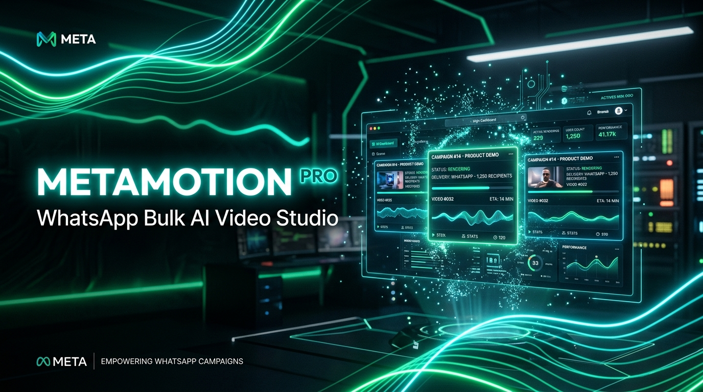
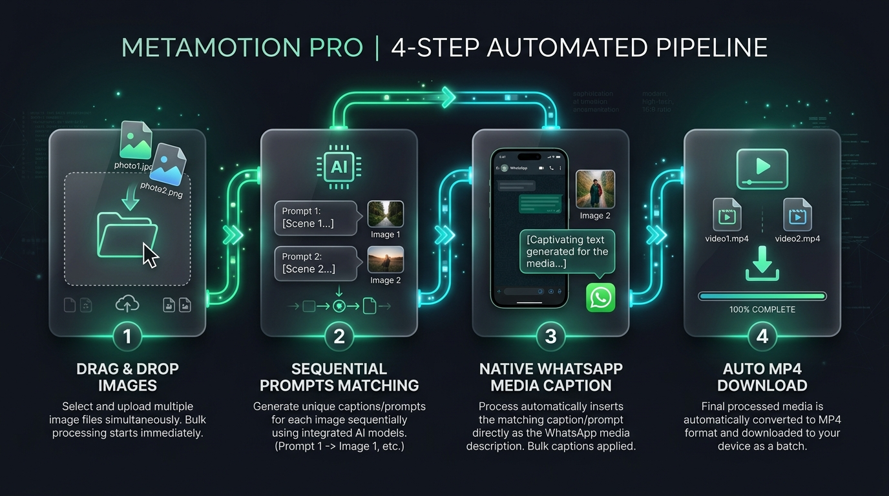
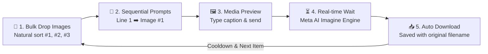
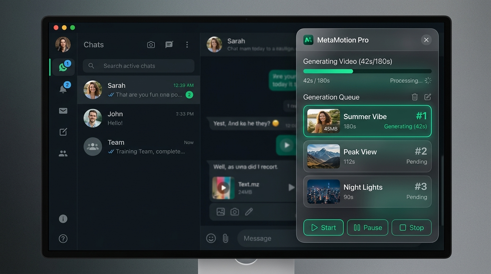
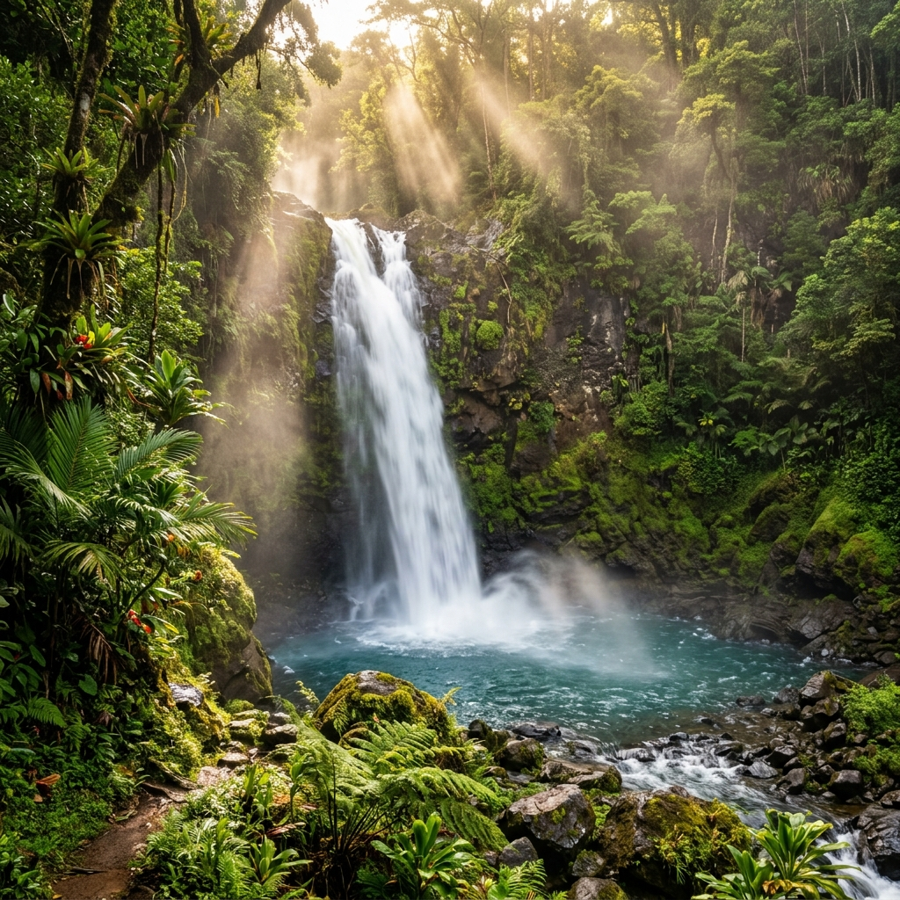
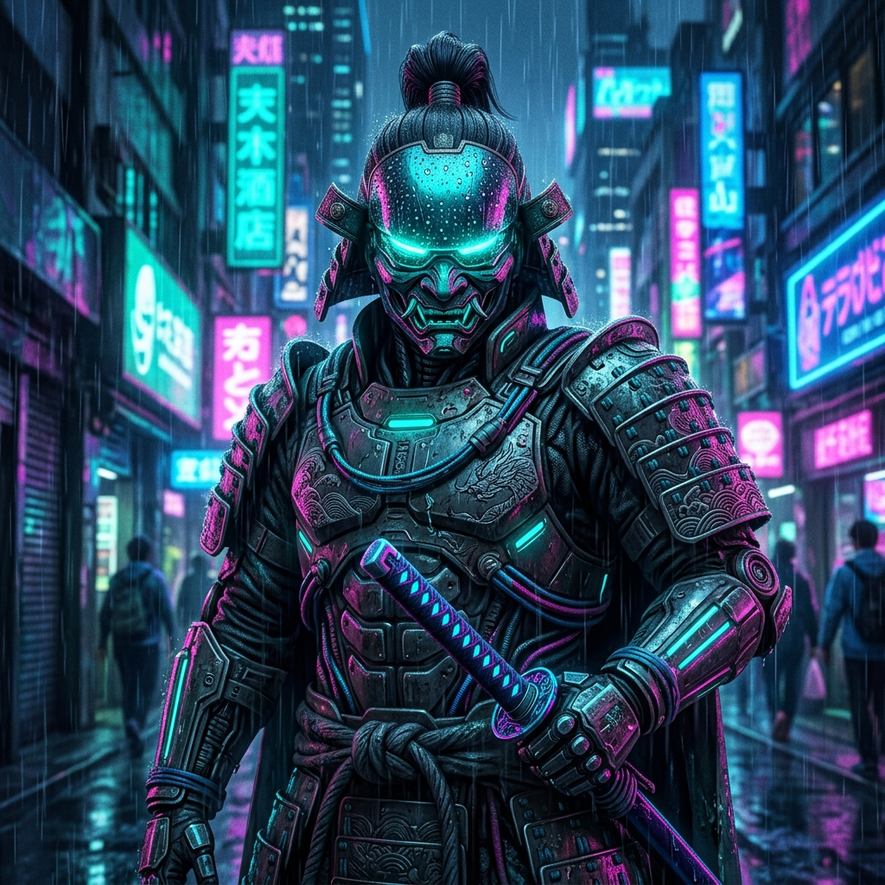

<div align="center">

# 🎬 MetaMotion Pro
### WhatsApp Bulk AI Video Studio (Chrome Extension v3.2.4)

[](https://developer.chrome.com/docs/extensions/mv3/)
[](https://web.whatsapp.com/)
[](LICENSE)
[](manifest.json)
[](https://github.com/mohdkhan837218-spec/meta-ai-whatsapp-animator)

<br/>



<br/>

**Transform dozens or hundreds of photos into animated AI videos automatically inside WhatsApp Web.**  
Features sequential 1-to-1 prompt matching, native WhatsApp Media Preview caption injection, patient real-time video generation wait, automatic timestamped MP4 downloads, and intelligent server outage protection.

</div>

---

## 🚀 4-Step Automated Pipeline





---

## 🖥️ Live Studio Interface Mockup



---

## ✨ Key Features & Capabilities

### 📂 1. Bulk Drag & Drop Queue with Natural Sorting
- Drop dozens or hundreds of photos at once into the glassmorphism dropzone.
- Automatic natural sorting (`1.jpg, 2.jpg...`, `IMG_001, IMG_002...`) guarantees that your prompt order always matches your image order.
- Real-time sequence badges (`#1, #2, #3...`) for instant visual clarity.

### 📝 2. Sequential Prompt Matching (1 Prompt per Image)
- Upload a `.txt` file containing your prompts or paste a multi-line list directly into the **Bulk Prompts** box.
- Line 1 matches Image #1, Line 2 matches Image #2, etc.
- Prompts immediately attach to queue cards and remain individually editable before generation.

### 🖼️ 3. Native WhatsApp Media Preview & Anti-Duplicate Captioning
- Automatically opens WhatsApp Web's native full-page Media Preview screen.
- Injects the prompt directly into WhatsApp's Lexical caption container (`[data-testid="media-caption-input-container"]`).
- Built-in anti-duplication engine prevents duplicated text (e.g. `animateanimate`).

### ⏳ 4. Patient Video Wait & Verified Media Stream Verification
- Meta AI image-to-video takes anywhere from **30 to 90 seconds**.
- MetaMotion Pro isolates each job strictly *after* the outgoing message anchor.
- Second-by-second live countdown counter on every card: `⏳ Meta AI is generating video... (42s / 180s)`.
- Rejects pure text disclaimers or stale earlier videos — only accepts confirmed, playable `<video>` streams (`blob:...`).

### 📥 5. Automatic Timestamped Video Downloads
- Automatically triggers instant video download via Chrome's background Downloads API.
- Preserves the original image filename and any timestamp flags (e.g. `IMG_20260917_124500.mp4`).
- Customizable naming schemes in Settings (Original Name, Prompt Name, or Image + Prompt).

### 🚨 6. Smart Server Outage Detection & Auto-Pause Safeguard
- Meta AI's video generation backend ("Imagine API") occasionally goes offline under high global server load.
- MetaMotion Pro detects Meta server-down phrases (`"Imagine API video generation failed"`, `"The video server at Meta's end hasn't come back online yet"`).
- **Auto-Pause Protection**: If 2 consecutive images fail due to Meta server downtime, the queue automatically pauses to protect your remaining images from being wasted.
- **"🔄 Retry Failed" Button**: Re-queues all skipped/failed images with a single click once Meta's servers recover!

---

## 🎨 Sample Demonstration Assets Included

Test the extension right away using the included sample assets in [`sample_images/`](sample_images/):

| Image #1: Rainforest Waterfall | Image #2: Cyberpunk Samurai | Image #3: Golden Hour Sports Car |
| :---: | :---: | :---: |
|  |  |  |
| *Flowing water & mist animation* | *Glowing neon & breathing animation* | *Cinematic sunset driving animation* |

Sample sequential prompts file: [`sample_images/prompts.txt`](sample_images/prompts.txt).

---

## 🛠️ Quick Installation Guide

### Prerequisites
- Google Chrome, Brave, Microsoft Edge, or any Chromium-based browser.
- WhatsApp Web logged in at [web.whatsapp.com](https://web.whatsapp.com/).

### Installation
1. **Clone the repository**:
   ```bash
   git clone https://github.com/mohdkhan837218-spec/meta-ai-whatsapp-animator.git
   ```
2. **Load into Browser**:
   - Open your browser and go to `chrome://extensions/`.
   - Enable **Developer mode** toggle in the top-right corner.
   - Click **"Load unpacked"** in the top-left.
   - Select the `meta-ai-whatsapp-animator` folder.
3. **Open WhatsApp Web**:
   - Navigate to [web.whatsapp.com](https://web.whatsapp.com/).
   - Click on the **Meta AI** chat.
   - Click the green **MetaMotion Pro** launcher pill at the bottom-right of your screen!

---

## 🎯 Step-by-Step Usage

1. **Upload Prompts**: Paste your multi-line prompts or click **"📂 Upload .txt"** (e.g. `sample_images/prompts.txt`).
2. **Drop Images**: Drag & drop your photos into the dropzone (e.g. `sample_images/1_waterfall.jpg`, `2_cyberpunk_samurai.jpg`...).
3. **Review Sequence**: Verify the `#1, #2, #3...` badges match your intended prompts.
4. **Click "Start Bulk Animation"**:
   - The studio will upload each photo, paste the prompt, wait for Meta AI to complete the video, save the MP4 to your Downloads, wait the cooldown, and proceed to the next item until finished!

---

## 📂 Project Architecture

```
meta-ai-whatsapp-animator/
├── manifest.json              # Manifest V3 extension configuration
├── background/
│   └── service-worker.js      # Background worker handling Chrome downloads API
├── content/
│   ├── content.js             # Content script coordinator & bridge injector
│   ├── injected-bridge.js     # MAIN world script: native Lexical caption & preview
│   ├── queue-manager.js       # Core state machine, prompt matcher & server protection
│   ├── ui-overlay.js          # Draggable floating studio pill, modal & cards
│   └── whatsapp-dom.js        # DOM selectors, video stream detection & anchor tracking
├── styles/
│   └── overlay.css            # Dark glassmorphism UI stylesheet
├── assets/                    # High-res branding graphics & workflow infographics
│   ├── banner.png             # 16:9 GitHub hero banner
│   ├── workflow_pipeline.png  # 4-step automated pipeline infographic
│   ├── ui_preview.png         # In-app UI software mockup preview
│   └── logo.png               # High-res MetaMotion Pro app logo
├── sample_images/             # Demonstration test images and prompt file
│   ├── 1_waterfall.jpg
│   ├── 2_cyberpunk_samurai.jpg
│   ├── 3_golden_hour_car.jpg
│   └── prompts.txt
├── icons/                     # Extension icons (16x16, 48x48, 128x128)
├── LICENSE                    # MIT License
└── README.md                  # Project documentation & visual presentation
```

---

## ⚙️ Settings & Options

| Setting | Default | Description |
| :--- | :---: | :--- |
| **Auto-Download** | `ON` | Automatically triggers browser download when video is generated. |
| **Filename Scheme** | `Original Name` | Preserves original photo filename and timestamp flags. |
| **Cooldown Delay** | `8s` | Safe delay between jobs to prevent rate limiting. |
| **Generation Timeout** | `180s` | Maximum wait time for Meta AI to render complex videos. |
| **Auto-Scroll** | `ON` | Keeps WhatsApp Web chat view scrolled to the bottom. |

---

## 🛡️ License

This project is licensed under the [MIT License](LICENSE) — free for personal, educational, and commercial use.

Created with ❤️ by [Mohd Khan](https://github.com/mohdkhan837218-spec).
